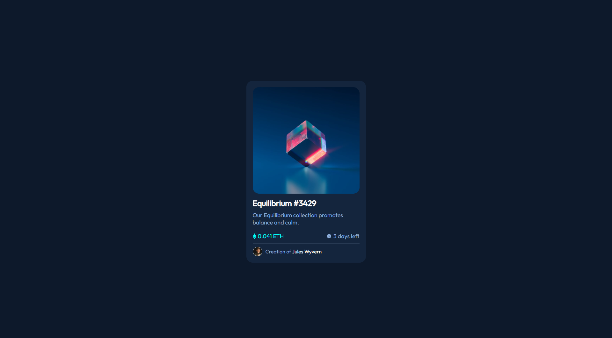

# Frontend Mentor - NFT preview card component solution

This is a solution to the [NFT preview card component challenge on Frontend Mentor](https://www.frontendmentor.io/challenges/nft-preview-card-component-SbdUL_w0U). Frontend Mentor challenges help you improve your coding skills by building realistic projects. 

## Table of contents

- [Overview](#overview)
  - [The challenge](#the-challenge)
  - [Screenshot](#screenshot)
  - [Links](#links)
- [My process](#my-process)
  - [Built with](#built-with)
  - [What I learned](#what-i-learned)
  - [Continued development](#continued-development)
  - [Useful resources](#useful-resources)
- [Author](#author)
- [Acknowledgments](#acknowledgments)

## Overview

### The challenge

Users should be able to:

- View the optimal layout depending on their device's screen size
- See hover states for interactive elements

### Screenshot

### Links

- Solution URL: [Solution](https://github.com/sonersimsekdev/frontendmentor.io-challenges/tree/main/1-NFT-preview-card-component-challenge)
- Live Site URL: [Live Demo](https://sonersimsekdev.github.io/frontendmentor.io-challenges/1-NFT-preview-card-component-challenge/index.html)

## My process

### Built with

- CSS custom properties
- Flexbox
- CSS Grid

### What I learned

### Continued development

### Useful resources
- image hover effects [src](https://codepen.io/sosuke/pen/Pjoqqp?editors=0010)

## Author

- Website - [https://sonersimsekdev.github.io/](https://sonersimsekdev.github.io/)
- Frontend Mentor - [@sonersimsekdev](https://www.frontendmentor.io/profile/sonersimsekdev)

## Acknowledgments

